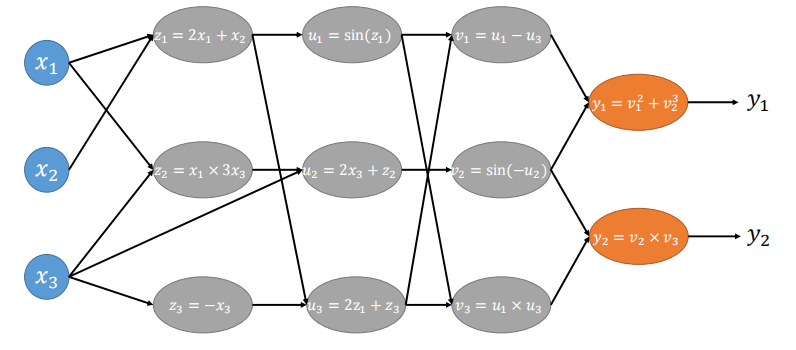

# 计算图




```mermaid
graph LR
1(x1) --2--> 2(z1=2x1+x2)--"cos(z1)"-->3("u1=sin(z1)")--1-->4("v1=u1-u2")--2v1-->5("y1=v1^2+v2^2")---->6("y1")
7(x2)-->2
1--3x3-->8
8("z2=x1*3x3")--"1"-->9("2x3+z2")--1-->10("v2=sin(-u2)")--v3-->11("y2=v2*v3)---->12(y2)
13(x3)---->14("z3=-x3z")---->15("u3=2z1+z3")---->16("v3=u1*u3")---->11
```

